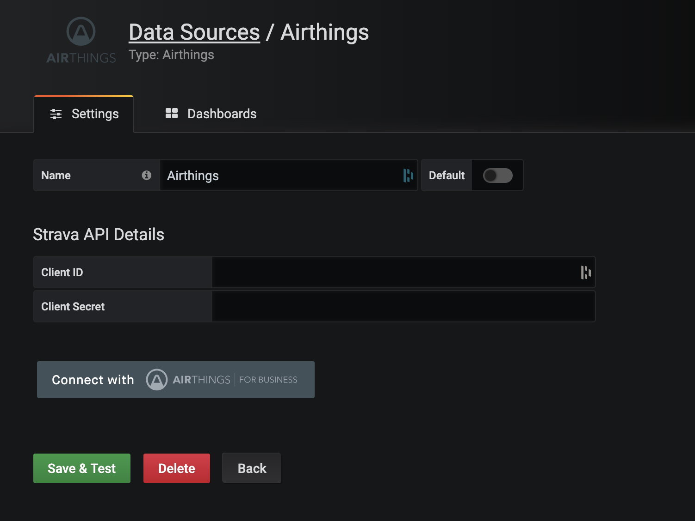
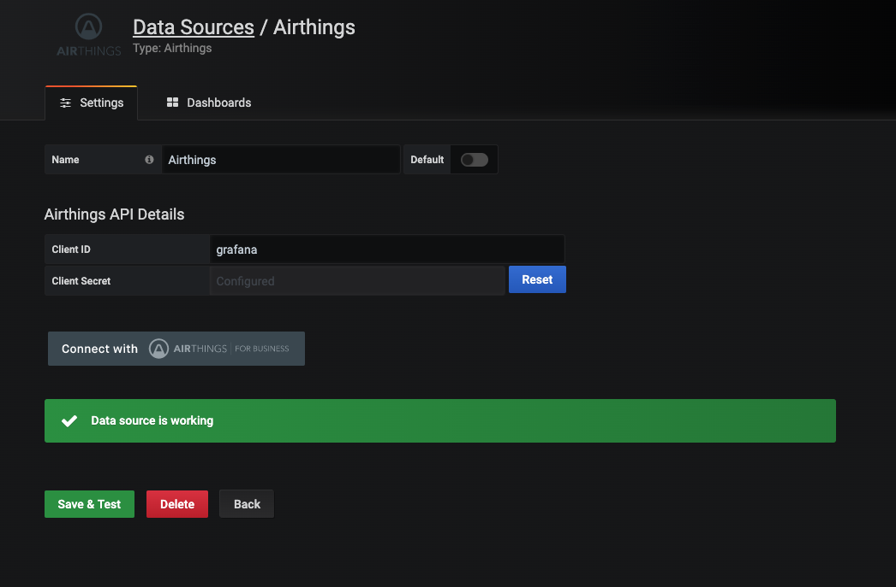

# Datasource Configuration

In order to use this datasource you will need to make an Airthings Client.

You can read more about setting up clients [here.](https://developer.airthings.com/docs/api.html)
The client needs to be configured as a confidential client  with code-grant and a redirect uri matching the grafana url.

When your client is created and ready to go, you copy the client id and secret to the datasource page.

Fill _Client ID_ field with value obtained from Strava API application page. Click the _Connect with Airthings_ button and allow grafana datasource to connect to Airthings. 

You will be redirected back to the datasource configuration page. Now fill _Client ID_ and _Client Secret_ fields. 

Finally, set desired data source name and click _Save & Test_ button. If connection is properly configured, you will see _Data source is working_ message.

Now you can create dashboards.
