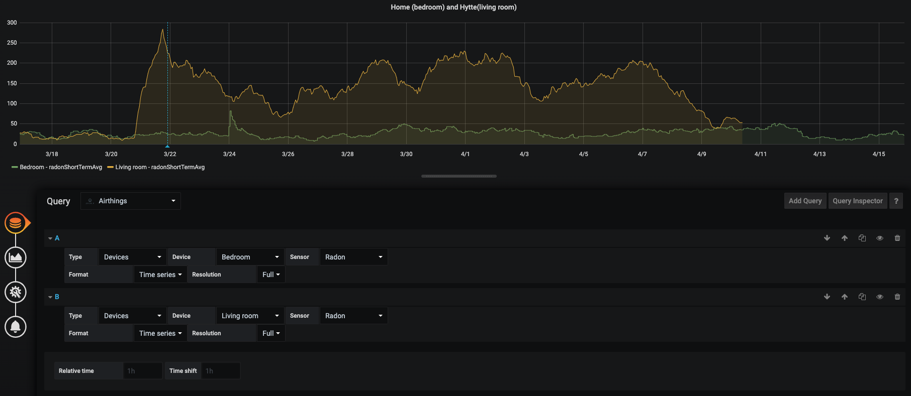

# Making a Grafana Datasource

Since Grafana provides nice visualising and comparing capabilities of time series data, and we have an API for the public, where we make measured data available.
We decided to make a Grafana datasource for our API.


# Grafana plugin architecture

	 +------------------+-------------------------+
	|                   | AIRTHINGS  |  AIRTHINGS  |
	|   GRAFANA         | CONFIG     |  QUERY      |
	|   FRONTEND        | EDITOR     |  EDITOR     |
	|                   |            |             |
	 +-----+------------+-------------------------+
	       |
	 +-----+-------+     +-----------------------+
	|               |   |                         |
	|               |   |                         |
	|               |   |                +--------+----+    
	|               |   |   AIRTHINGS    | AIRTHINGS   +---> AirthingsAuthQuery (OAuth2-code for token)
	|   GRAFANA     |   |   PLUGIN       | DATASOURCE  |
	|   SERVER      |   |                |             +---> EXT-API (Devices, Locations, samples)
	|               |   |                +--------+----+
	|               |   |                         |
	|               |   |                         |
	|               |   |                         |
	 +---------++--+     +---++------------------+
	           ||            ||
	           ++------------++
	                 RPC
## Frontend

*React-components* for Datasource: 
 - Configuration form.
 - Query editor. 
 
The components store whatever data you chose to provide automatically, as long as you call onChange.
 
 *The API-class* handles api requests and auth-exchanges and refreshing.
 
 *The DataSource-class* has to be modified with parsing of the data it receives from the backend to a format that Grafana can present in its visualisations (time series, world-map, etc).

## Backend

The Golang backend consists of the Grafana server process and plugins processes. These are built using [go-plugin](https://github.com/hashicorp/go-plugin).

This plugin-architecture (with go) has a number of benefits:

 - Plugins can't crash your host process: A panic in a plugin doesn't panic the plugin user.
 - Plugins are very easy to write: just write a Go application and  `go build`. Or use any other language to write a gRPC server with a tiny amount of boilerplate to support go-plugin.
 - Plugins are very easy to install: just put the binary in a location where the host will find it (depends on the host but this library also provides helpers), and the plugin host handles the rest.
 - Plugins can be relatively secure: The plugin only has access to the interfaces and args given to it, not to the entire memory space of the process. Additionally, go-plugin can communicate with the plugin over TLS.

The backend uses the key-value [go-cache](github.com/patrickmn/go-cache), for storing access tokens and refresh tokens etc.

### The Plugin Interface
The interface Grafana specifies for plugins is available in [grafana-plugin-model](github.com/grafana/grafana-plugin-model/go/datasource).
  
```
package datasource

import (
	"context"

	plugin "github.com/hashicorp/go-plugin"
	"google.golang.org/grpc"
)

type DatasourcePlugin interface {
	Query(ctx context.Context, req *DatasourceRequest) (*DatasourceResponse, error)
}

...
```

To make the plugin run a main method is required and an instantiation of the datasource-plugin(implementing the DatasourcePlugin interface above).

```
package main

import (
	"os"
	"path/filepath"
	"time"

	"github.com/grafana/grafana-plugin-model/go/datasource"
	hclog "github.com/hashicorp/go-hclog"
	plugin "github.com/hashicorp/go-plugin"
	cache "github.com/patrickmn/go-cache"
)

const DATA_PATH_VARIABLE = "GF_AIRTHINGS_DS_DATA_PATH"

var pluginLogger = hclog.New(&hclog.LoggerOptions{
	Name:  "airthings-datasource",
	Level: hclog.LevelFromString("DEBUG"),
})

func main() {
	pluginLogger.Debug("Running Airthings backend datasource")

	var dataDir string
	dataDir, exist := os.LookupEnv(DATA_PATH_VARIABLE)
	if !exist {
		dataDir, _ = filepath.Abs(filepath.Dir(os.Args[0]))
	}
	pluginLogger.Debug("Plugin data dir", "path", dataDir)

	plugin.Serve(&plugin.ServeConfig{
		HandshakeConfig: plugin.HandshakeConfig{
			ProtocolVersion:  1,
			MagicCookieKey:   "grafana_plugin_type",
			MagicCookieValue: "datasource",
		},
		Plugins: map[string]plugin.Plugin{
			"airthings-backend-datasource": &datasource.DatasourcePluginImpl{Plugin: &AirthingsPlugin{
				datasourceCache: cache.New(10*time.Minute, 10*time.Minute),
				logger:          pluginLogger,
				dataDir:         dataDir,
			}},
		},

		// A non-nil value here enables gRPC serving for this plugin...
		GRPCServer: plugin.DefaultGRPCServer,
	})
}

```

The Datasource-plugin implementation the required Query method with some logic for doing:
- Auth triggered from the datasource-configuration page in Grafana. 
- Fetching data for visualisations. It takes the query-request from the frontend unwrap its content, enrich it with access token and call the Airthings-API accordingly.

```
func (p *AirthingsPlugin) Query(ctx context.Context, tsdbReq *datasource.DatasourceRequest) (resp *datasource.DatasourceResponse, err error) {

	AirthingsDS, err := p.GetDatasource(tsdbReq)
	if err != nil {
		return nil, err
	}

	queryType, err := getQueryType(tsdbReq)
	if err != nil {
		return nil, err
	}

	switch queryType {
	case AirthingsApiQueryType:
		resp, err = AirthingsDS.AirthingsAPIQuery(ctx, tsdbReq)
	case AirthingsAuthQueryType:
		resp, err = AirthingsDS.AirthingsAuthQuery(ctx, tsdbReq)
	default:
		err = errors.New("Query not implemented")
	}

	if err != nil {
		return buildErrorResponse(err, nil), nil
	}

	return
}
```


# Using the data source

## Setup (OSX)
  
    brew update  
    brew install grafana    # if you don't have it.  
    brew install go         # if you don't have it.  
      
    ## Build the plugin ##  
      
    cd /usr/local/var/lib/grafana/plugins  
    git clone git@github.com:devdavidkarlsson/grafana-airthings-datasource.git  
    cd grafana-airthings-datasource  
    make install  
    make dist  
      
    ## Start/restart Grafana    
    brew services restart grafana  
      
    ## The data source should be available (in the bottom of the list) at: ##  
    open http://localhost:3000/datasources/new  

## Config


See [configuration](https://github.com/devdavidkarlsson/grafana-airthings-datasource/blob/master/docs/configuration.md) docs.

## Querying
The resulting dashboard panel presents the user with the QueryEditor React component and updates the visualizations according to what is selected for display.

